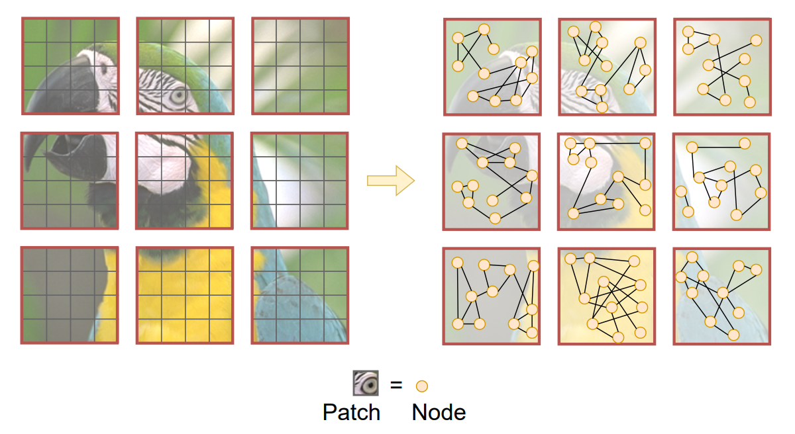
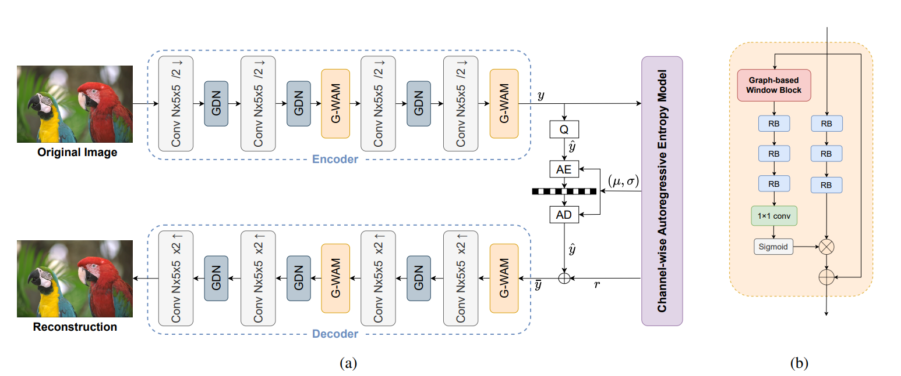
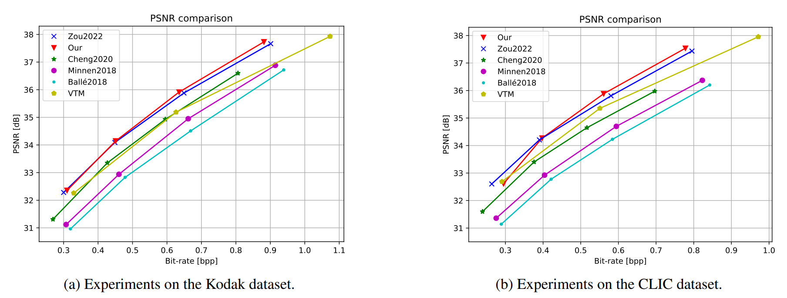

# GABIC: GRAPH-BASED ATTENTION BLOCK FOR IMAGE COMPRESSION


Pytorch implementation of the paper "**GABIC: GRAPH-BASED ATTENTION BLOCK FOR IMAGE COMPRESSION**", published at ICIP 2024. This repository is based on [CompressAI](https://github.com/InterDigitalInc/CompressAI) and [STF](https://github.com/Googolxx/STF)

[Paper link](https://ieeexplore.ieee.org/stamp/stamp.jsp?arnumber=10647413)

<div align="center">

</div>

## Abstract
While standardized codecs like JPEG and HEVC-intra
represent the industry standard in image compression, neural Learned Image Compression (LIC) codecs represent a
promising alternative. In detail, integrating attention mechanisms from Vision Transformers into LIC models has shown
improved compression efficiency. However, extra efficiency
often comes at the cost of aggregating redundant features.
This work proposes a Graph-based Attention Block for Image Compression (GABIC), a method to reduce feature redundancy based on a *k*-Nearest Neighbors enhanced attention
mechanism. Our experiments show that GABIC outperforms
comparable methods, particularly at high bit rates, enhancing
compression performance.


<div align="center">

</div>


## Usage
### Train

```
cd src

python train.py \
--save-dir /path/to/save \
--model wgrcnn_cw \
--lambda 0.0035 \
--epochs 200 \
--num-workers 4 \
--cuda \
--project-name name \
--dataset /path/to/openimages/ \
--test-pt /path/to/kodak \
--save \
--knn 9 \
--graph-conv transf_custom \
--local-graph-heads 8 \
--use-edge-attr \
--seed 42
```

### Evaluation
- Download our pretrained model in the GABIC directory from [here](TODO).
- Extract model_results.zip
- Run:
```
cd src

python -m evaluate.eval --dataset /path/to/kodak
```

## Results


<div align="center">

</div>
